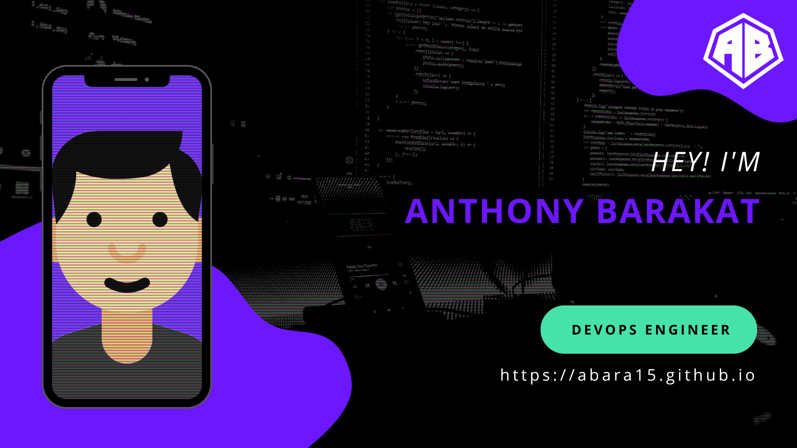

# Intro
Hey everyone 👋

My name is Anthony Barakat. I'm a Software Engineer based in Sydney, AU. I work full-stack, but specialise in front-end development. I enjoy working on cool projects and web apps that are made user-first!

I am proficient in JavaScript, Python, React.js, Node.js, Sass, and C, and am currently in the middle of learning Golang and Terraform.

If you're interested in reaching out or learning a bit more about me, check my socials above or my portfolio [here](https://abara15.github.io)!

# Top Repos

<!-- GitHub Stats -- >

<!-- 
- 👋 Hi, I’m @abara15
- 👀 I’m interested in ...
- 🌱 I’m currently learning ...
- 💞️ I’m looking to collaborate on ...
- 📫 How to reach me ... -->

<!---
abara15/abara15 is a ✨ special ✨ repository because its `README.md` (this file) appears on your GitHub profile.
You can click the Preview link to take a look at your changes.
--->
